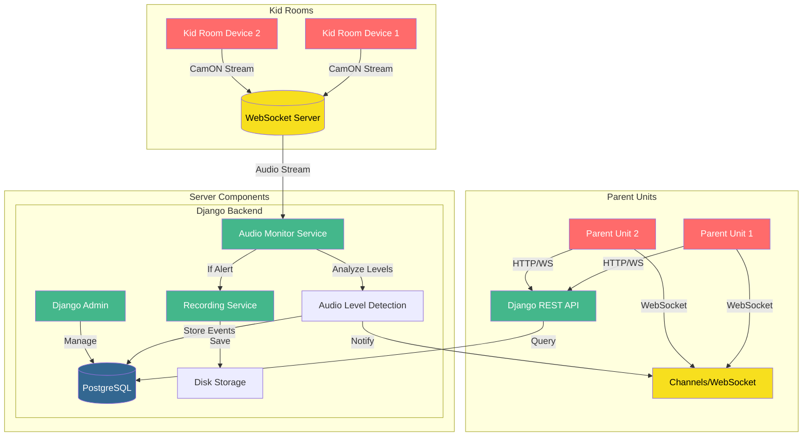

# babycam-django

Turn your old phone and laptop into a baby camera+monitor for multiple parents and kids!

## System Diagram



## Project setup

On Ubuntu dev machines:

```bash
# first create a venv, then:
sudo apt-get install portaudio19-dev # pre-req for pyaudio on ubuntu
pip install -r requirements.txt
```
