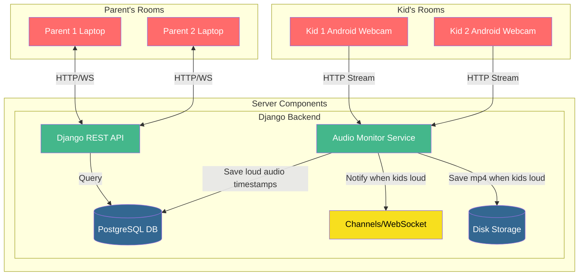

# babycam-django

Turn your old phone and laptop into a baby camera+monitor for multiple parents and kids!

## Features Roadmap

* ✅ Multiple parent units can view multiple kid rooms, live video+audio feeds
* ✅ Audio level detection with alerts, with customizable audio thresholds
* ✅ Video recording on alert
* ❌ Shared chat so parents can leave messages for each other
* ❌ Schedule which parent will receive alerts when kids wake up
* ❌ Ability to adjust the schedule on-the-fly
  * e.g. if mom was supposed to do the 3AM wakeup but had a rough sleep, she can set an override and go to sleep, and dad will get the alert instead

## System Diagram



## Project setup

### Backend

On Ubuntu dev machines:

First you need to set up postgresql and create a database for the project. You can do this by running the following commands:

```zsh
# This assumes you already have postgres installed, if not, go do that.
sudo -u postgres psql
# Then from within psql, create the user and database:
CREATE USER babycam_user WITH PASSWORD 'Use DB_PASSWORD from the .env file here';
CREATE DATABASE babycam;
GRANT ALL PRIVILEGES ON DATABASE babycam TO babycam_user;
\q

# Now, connect to the babycam DB:
sudo -u postgres psql -d babycam
# Then from within psql, set up the schema and permissions:
ALTER SCHEMA public OWNER TO babycam_user;
ALTER ROLE babycam_user SET search_path = public, pg_catalog;
```

Next, install the apt and python packages:

```zsh
# first create and activate a venv:
python -m venv venv
source venv/bin/activate
# Don't forget to set the vscode interpreter to the venv python after the above.

sudo apt install portaudio19-dev # pre-req for pyaudio on ubuntu
sudo apt install redis-server # needed for inter-process communication between test_monitor.py and the main django server.
pip install -r requirements.txt
```

### Frontend

```zsh
cd ./frontend
npm install --legacy-peer-deps # required to get around the peer dependency on React 16 by @gumlet/react-hls-player
```

## Running the app

### Backend

```zsh
# Need to run it this way instead of the usual `python manage.py run_server` in order for websockets to work
# NOTE: This doesn't do hot reloading of backend changes, you'll have to ctrl+C and re-run it
python -m daphne babycam.asgi:application -b 0.0.0.0 -p 8000
```

### Frontend
```zsh
cd frontend
npm run dev
# Then alt+click the URL to open it in the browser
```

# Dev Notes

## Django stuff

When you make changes to the `models.py` file, you need to run `python manage.py makemigrations` and `python manage.py migrate` to apply the changes to the database.

TODO I'd like to replace pip with uv and use a toml file for the dependencies, makes it easier to see which deps are direct deps vs indirect deps. uv is faster than pip and has a better lockfile format.