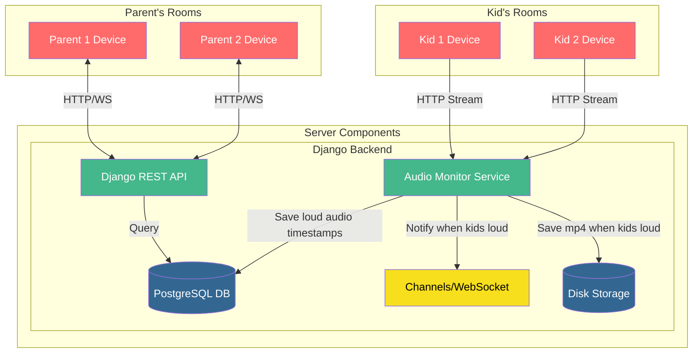

# babycam-django

Turn your old phone and laptop into a baby camera+monitor for multiple parents and kids!

## Features Roadmap

* ❌ Multiple parent units can view multiple kid rooms, live video+audio feeds
* ✅ Audio level detection with alerts, with customizable audio thresholds
* ✅ Video recording on alert
* ❌ Shared chat so parents can leave messages for each other
* ❌ Schedule which parent will receive alerts when kids wake up
* ❌ Ability to adjust the schedule on-the-fly
  * e.g. if mom was supposed to do the 3AM wakeup but had a rough sleep, she can set an override and go to sleep, and dad will get the alert instead

## System Diagram



## Project setup

### Backend
On Ubuntu dev machines:

```zsh
# first create a venv, then:
sudo apt install portaudio19-dev # pre-req for pyaudio on ubuntu
sudo apt install redis-server # needed for inter-process communication between test_monitor.py and the main django server.
pip install -r requirements.txt
```

### Frontend
```zsh
cd ./frontend
npm install
```

## Running the app

### Backend

```zsh
# Need to run it this way instead of the usual `python manage.py run_server` in order for websockets to work
# NOTE: This doesn't do hot reloading of backend changes, you'll have to ctrl+C and re-run it
python -m daphne babycam.asgi:application -b 0.0.0.0 -p 8000
```

### Frontend
```zsh
cd frontend
npm run dev
# Then alt+click the URL to open it in the browser
```
